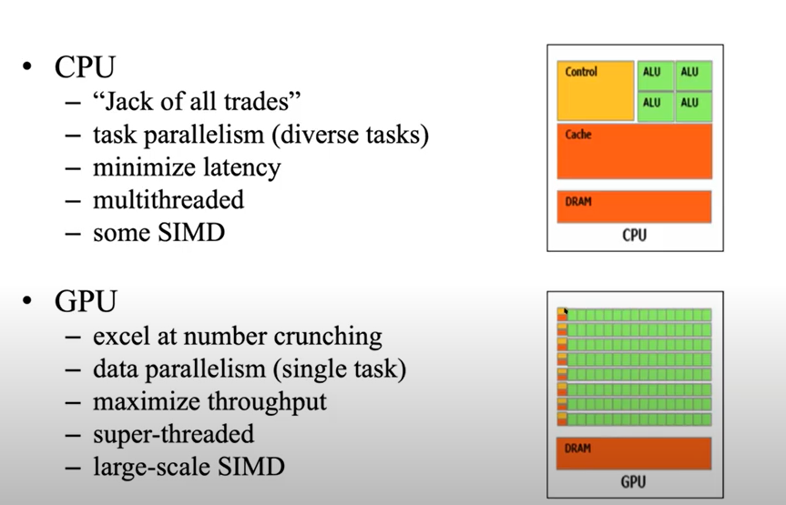

# CUDA Fortran: Fortran programming on GPU


<sup> Disclaimer: There is no way possible to learn CUDA Fortran completely just from this one page Tutorial/Cheatsheet. This is only meant for a quick reference sheet to get started with GPGPU programming with CUDA Fortran. </sup>

---


## GPU & CUDA Programming Model  
&nbsp;

- __The Host & Device:__ The CPU and its memory is called the host. On the other hand the GPU and its memory is called the device. They are usually connected with PCI bus which have much slower data bandwidth compared to the each processing unit and their memory and moving data between them is time consuming. Thus frequent exchange of data between the two memory is highly discourage

- __Kernels:__ A function that is executed on the GPU.
- __Threads Hierarchy__ 
    - __Thread:__ At the lowest level of CUDA threads hierarchy are the individual threads. Each thread execute the kernel on a single piece of data and each gets mapped to a single CUDA core.
    - __Blocks:__ A group of thread.
    - __Grid:__ The collection of blocks that gets mapped on the entire GPU 
    - Blocks and Grids can be 1D, 2D or 3D and the program has to written in such way to control over multidimensional Blocks/Grids.

- __Flow of Program:__ The main code execution is started on the CPU aka the host. Separate memory are allocated for host and device to hold the data for each of their computation. When needed the data is copied to the device from host and back. Host can launch a group of kernels on the device. When the kernels are launched, the host does not wait for the kernels execution to finish and can proceed with its own flow. The memory copy between the host and can be synchronous or asynchronous. Usually they are done in synchronous manner. The assignment operator (`=`) in CUDA Fortran is overloaded with synchronous memory copy i.e. the copy operation will wait for the kernels to finish their execution

---

### CUDA Fortran Installation:
1. Install the appropriate Nvidia drivers for your system. 
2. Install the Nvidia CUDA toolkit. 
3. Install Nvidia HPC SDK from https://developer.nvidia.com/nvidia-hpc-sdk-downloads. The installation path is usually `/opt/nvidia/hpc_sdk/Linux_x86_64/*/compilers/bin`, add it to your PATH. 

P.S. You may have to restart your system, before using the compilers.

--- 

### Compilation and Execution

Earlier the CUDA Fortran compiler was developed by PGI. From 2020 the PGI compiler tools was replaced with the Nvidia HPC Toolkit. You can use compilers like `nvc`, `nvc++` and `nvfortan` to compile `C`, `C++` and `Fortran` respectively.

- CUDA Fortran codes have suffixed `.cuf`

- Compile CUDA Fortran with `nvfortran` and just run the executable

```bash
nvfortran test_code.cuf -o test_exe
./test_exe
```
---

### CUDA Fortran Code:
Will follow the SAXPY (Scalar A*X Plus Y) aka the "Hello World" problem for CUDA programming to show how to go from CPU to GPU code. 

The serial CPU code
```Fortran
module mathOps
    contains
       subroutine saxpy(x, y, a)
        implicit none
        real :: x(:), y(:), a
        ! Just a simple array scaler multiplication and addition
        y = a*x +y
      end subroutine saxpy 
    end module mathOps
    
    program testSaxpy
      use mathOps
      implicit none
      integer, parameter :: N = 40000
      real :: x(N), y(N), a

      x = 1.0; y = 2.0; a = 2.0

      write(*,*) 'Max error: ', maxval(abs(y-4.0))
    end program testSaxpy 
````

The above CPU code is ported to CUDA fortran as follows, brief explanation are given in between the codes:

```fortran
module mathOps
  contains
  ! The kernel i.e a function that runs on the device 
  ! `attributes` describes the scope of the routine. `global` means its visible both from the host
  ! and device. This indicates the subroutine is run on the device but called from the host
    attributes(global) subroutine saxpy(x, y, a)
      implicit none
      real :: x(:), y(:)
      real, value :: a
      integer :: i, n
      n = size(x)

      ! Remember the host launches "**grid** of block with each block having **tBlock** threads"
      ! and each thread works on a single element of the array
      ! These `blockDim`, `blockIdx` and `threadIdx` are provided defined by CUDA are similar to 
      ! `dim3` type. As we used only `x` component to launch the kernel only `x` component is used

      ! Think of this as there are groups (=`grid` in host) of threads and those groups are numbered 
      ! with `blockIdx`. Each group has `blockDim` (=`tBlock` in host) number of threads and each 
      ! thread inside a particular block is numbered with `threadIdx`. 
      ! Thus using this following formula we can calculate the offset of the element of array to be computed

      i = blockDim%x * (blockIdx%x - 1) + threadIdx%x
      !^ Note: This is an example of fine-grained parallelism

      ! As we have launched more threads in the host than there are array element 
      ! a conditional check is required
      if (i <= n) y(i) = y(i) + a*x(i)

    end subroutine saxpy 
  end module mathOps
  
  program testSaxpy
    use mathOps
    ! Fortran module that contains all the CUDA Fortran definitions
    use cudafor
    implicit none
    integer, parameter :: N = 40000
    ! host arrays
    real :: x(N), y(N), a
    ! device arrays, they are declared with the `device` attribute
    real, device :: x_d(N), y_d(N)
  
    ! Thread configuration to launch the kernel
    ! Threads and block can be arranged in multidimensional nature. 
    ! Here the they are defined as `dim3`, so they as have three components `x`,`y` and `z`.
    type(dim3) :: grid, tBlock
  
    
    ! In this example `tBlock` has 256 threads in `x` components and 
    ! `grid` is defined such a way to accomodate all the `N = 40000` computation in blocks 
    ! each having 256 threads.
    tBlock = dim3(256,1,1)
    grid = dim3(ceiling(real(N)/tBlock%x),1,1)
  
    x = 1.0; y = 2.0; a = 2.0
  
    ! copies the array from host to device and vice versa. 
    ! The `cudafor` module overloads the assignment operator with `cudaMemcpy` calls 
    ! so that the memory transfer can be done with a simple assignment operation. 
    ! Note: This step actually moves data beween two physical devices and actually can be time consuming.
    ! P.S. CUDA memory copy can also be done in asynchronous
    x_d = x
    y_d = y

    ! Launches the kernel on the device. 
    ! The information between the tripple braces are the excution configuration 
    ! it says to launch **grid** of block with each block having **tBlock** threads.
    ! This call is asynchronous, so the host can just call this and 
    ! proceed to the next line without it's computation on the device being completed
    call saxpy<<<grid, tBlock>>>(x_d, y_d, a)


    ! Copyies data back to host. 
    ! This process is synchronous and waits for the device to complete the calculation
    y = y_d
    write(*,*) 'Max error: ', maxval(abs(y-4.0))
  end program testSaxpy
```


### Profiling:
Profiling can be done with the `nvprof` utility. 

<details>	

  <summary>A profiling on the `saxpy.cuf` code</summary>

```bash
$ nvfortran saxpy.cuf
$ sudo nvprof ./a.out
==2688609== NVPROF is profiling process 2688609, command: ./a.out
 Max error:     0.000000    
==2688609== Profiling application: ./a.out
==2688609== Profiling result:
            Type  Time(%)      Time     Calls       Avg       Min       Max  Name
 GPU activities:   64.44%  108.26us         4  27.063us     608ns  53.727us  [CUDA memcpy HtoD]
                   28.55%  47.968us         1  47.968us  47.968us  47.968us  [CUDA memcpy DtoH]
                    7.01%  11.776us         1  11.776us  11.776us  11.776us  mathops_saxpy_
      API calls:   99.78%  188.02ms         4  47.004ms  2.6290us  188.01ms  cudaMalloc
                    0.11%  216.32us         5  43.264us  2.5470us  74.525us  cudaMemcpy
                    0.05%  103.29us         4  25.822us  2.2740us  80.366us  cudaFree
                    0.03%  63.516us       101     628ns      81ns  27.537us  cuDeviceGetAttribute
                    0.01%  17.552us         1  17.552us  17.552us  17.552us  cudaLaunchKernel
                    0.01%  11.915us         1  11.915us  11.915us  11.915us  cuDeviceGetName
                    0.00%  4.8980us         1  4.8980us  4.8980us  4.8980us  cuDeviceGetPCIBusId
                    0.00%     884ns         3     294ns      75ns     682ns  cuDeviceGetCount
                    0.00%     507ns         2     253ns      83ns     424ns  cuDeviceGet
                    0.00%     241ns         1     241ns     241ns     241ns  cuDeviceTotalMem
                    0.00%     138ns         1     138ns     138ns     138ns  cuDeviceGetUuid
```

</details>

---


## Source Codes examples
#### Loop parallelization:
`!$cuf kernel do` directive can be used to simplify parallelizing loops. These directives instruct the compiler to generate kernels from a region of host code consisting of tightly nested loops. Essentially, kernel loop directives allow us to inline kernels in host code.  
1. [Loop parallelization](./src/cufKernel.cuf)
1. [Loop parallelization 2](./src/cufILP.cuf)
3. [Nested Loop parallelization](./src/cufKernel2D.cuf)
4. [Reduction operation](./src/cufReduction.cuf)


#### Few other sample code
5. [Compute pi using a Monte Carlo method](./src/ComputePI/)
6. [Fast Fourier Transform](./src/FFT/)
7. [Derivative with FFT](./src/FFT/)


---

&nbsp;

### References
1. __CUDA Fortran for Scientists and Engineers__ by Gregory Ruetsch & Massimiliano Fatica
2. https://developer.nvidia.com/blog/easy-introduction-cuda-fortran/
3. https://docs.nvidia.com/hpc-sdk/compilers/cuda-fortran-prog-guide/